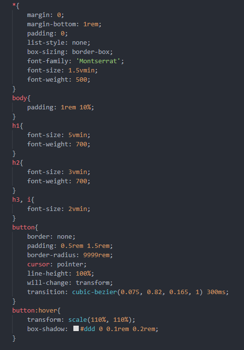

[![Forks][forks-shield]][forks-url]
[![Stargazers][stars-shield]][stars-url]
[![Issues][issues-shield]][issues-url]
[![MIT License][license-shield]][license-url]

<!-- ABOUT THE PROJECT -->
## About The Project

  

Just the basics to get started with web development using parceljs - HTML, SCSS, JS.
_Includes import of font-awesome, google fonts and defines default values for elements ( ex: *{margin: 0; padding:0}, etc... )._

(<a href="#top">back to top</a>)

<!-- LICENSE -->
## License

Distributed under the MIT License. See `LICENSE.txt` for more information.

(<a href="#top">back to top</a>)

<!-- MARKDOWN LINKS & IMAGES -->
<!-- https://www.markdownguide.org/basic-syntax/#reference-style-links -->
[forks-shield]: https://img.shields.io/github/forks/MathieuRodri/Parcel-App-Startup-Project.svg?style=for-the-badge
[forks-url]: https://github.com/MathieuRodri/Parcel-App-Startup-Project/network/members
[stars-shield]: https://img.shields.io/github/stars/MathieuRodri/Parcel-App-Startup-Project.svg?style=for-the-badge
[stars-url]: https://github.com/MathieuRodri/Parcel-App-Startup-Project/stargazers
[issues-shield]: https://img.shields.io/github/issues/MathieuRodri/Parcel-App-Startup-Project.svg?style=for-the-badge
[issues-url]: https://github.com/MathieuRodri/Parcel-App-Startup-Project/issues
[license-shield]: https://img.shields.io/github/license/MathieuRodri/Parcel-App-Startup-Project.svg?style=for-the-badge
[license-url]: https://github.com/MathieuRodri/Parcel-App-Startup-Project/blob/main/LICENSE
[product-screenshot]: images/screenshot.png
